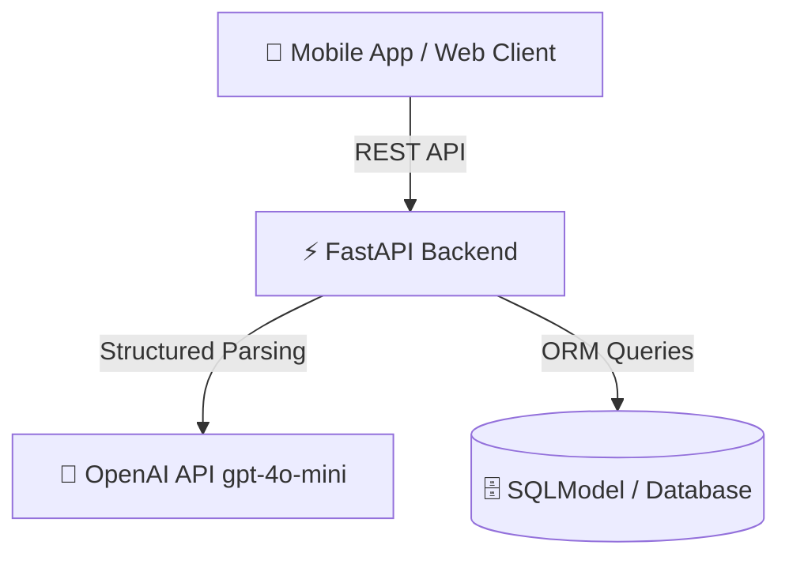
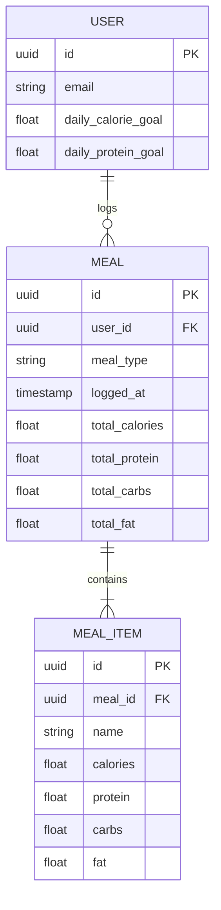

# LyfSync 2.0 System Architecture

## 🏛️ High-Level Architecture Overview

LyfSync 2.0 follows a decoupled client-server architecture built for high responsiveness, structured AI processing, and seamless offline-first synchronization.

---

## 🛠️ Tech Stack

### Backend Service
* **Framework:** FastAPI (Python 3.10+) for high-performance async REST APIs.
* **ORM & Data Validation:** SQLModel (combining SQLAlchemy + Pydantic) ensuring strict type checking across database models and API payloads.
* **AI & NLP Engine:** OpenAI API (`gpt-4o-mini`) utilizing Pydantic structured output (`beta.chat.completions.parse`) for deterministic JSON responses.
* **Server Server:** Uvicorn ASGI server.

### Client Layer (Planned)
* **Mobile / Web:** React Native / Expo or modern web app communicating via secure REST endpoints.
* **Local Caching:** Local storage for offline logging queue and instant UI optimism.

---

## 🤖 AI Parsing Workflow

When a user submits a natural language meal string (e.g., *"2 paneer parathas and a bowl of curd"*), the pipeline executes as follows:
1. **Request Reception:** Client POSTs payload to `/api/v1/meals/parse`.
2. **Schema Enforcement:** Pydantic validates input string.
3. **Structured Prompting:** Backend invokes OpenAI with system instructions emphasizing itemized extraction and exact macronutrient estimation.
4. **Deterministic Response:** OpenAI enforces schema compliance against `MealResponse` and `MealItemResponse` Pydantic models.
5. **Return & Persist:** Backend validates parsed tokens and returns structured breakdown to client.

---

## 💾 Database Architecture (Core Entities)

---

## 🔒 Security & Performance Guidelines
* **Environment Variables:** API keys (`OPENAI_API_KEY`, database credentials) must be managed via `.env` files and never committed to version control.
* **Error Isolation:** External API failures (e.g., OpenAI rate limits or timeouts) are caught and returned as clean HTTP 500/502 errors without exposing internal stack traces.
