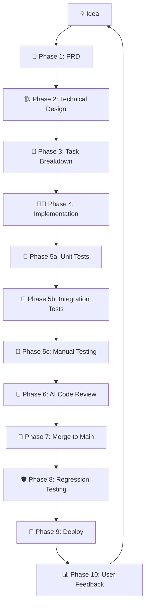

# Software Development Lifecycle (SDLC) Guide

This guide outlines the structured 10-phase Software Development Lifecycle tailored for AI-assisted engineering. By following this disciplined framework, we ensure high code quality, predictability, and maintainability while leveraging AI as a powerful pair programmer and reviewer.

---

## 🔄 Overall Feature Workflow

---

## Phase 1: Product Planning (PRD)

Before writing any code, create a **Product Requirements Document (PRD)**. For every feature, answer the following core questions:
1. **What problem does it solve?**
2. **Who uses it?**
3. **What is the success metric?**
4. **What are the edge cases?**
5. **What are the exact acceptance criteria?**

### Example PRD: Quick Meal Logging
* **Problem:** Users don't log meals because existing flows take too long.
* **Success Metric:** A user can log a complete meal in under 15 seconds.
* **Acceptance Criteria:**
  - Search food items via NLP or database lookup.
  - Enter or adjust quantity/portions.
  - Save to daily journal.
  - Automatically update daily macro totals.
  - Works offline with local storage.
  - Syncs to cloud automatically when connection is restored.

> 🛑 **Gate Check:** Only after this document is complete do you move on to Technical Design.

---

## Phase 2: Technical Design (You + AI)

Collaborate with AI to design the architecture before asking it to generate code.

**Example Prompt to AI:**
> *"Design the backend architecture for offline meal logging using FastAPI, PostgreSQL (Supabase), and background sync."*

**Required Deliverables:**
* **Database Schema:** Tables, columns, foreign keys, and indexes.
* **API Contracts:** Request/response payloads and status codes.
* **Folder Structure:** Module organization.
* **Sequence Diagrams:** Data flow between client, local storage, and remote server.
* **Error Handling:** Strategy for network drops and validation failures.
* **Sync Strategy:** Conflict resolution and queue management.

---

## Phase 3: Break Into Tasks

Avoid broad monolithic prompts like *"Build meal logging."* Instead, break the design into bite-sized tickets where each ticket takes a few hours rather than several days.

### Example Ticket Breakdown:
* **Ticket 1:** Create `Meal` and `MealItem` database models.
* **Ticket 2:** Meal CRUD API endpoints.
* **Ticket 3:** Offline Supabase cloud storage setup.
* **Ticket 4:** Background sync worker background job.
* **Ticket 5:** Conflict resolution logic (last-write-wins or versioned).
* **Ticket 6:** Mobile UI screen and form binding.

---

## Phase 4: Development (AI Pair Programmer Pattern)

Now the AI writes code, but **you act as the technical lead and reviewer**.

### The Iterative Pattern:
1. **Explain the ticket** clearly to the AI providing relevant context.
2. **Ask AI for an implementation plan** first.
3. **Review the plan** and refine decisions.
4. **Generate the code** step-by-step.
5. **Run and execute** locally.
6. **Fix issues** collaboratively.
7. **Commit** clean atomic changes.

> ⚠️ **Rule:** Avoid generating an entire complex feature in a single prompt.

---

## Phase 5: Testing

For every ticket, test across three distinct layers:

### 1. Unit Tests
Test individual functions and isolated logic.
* *Example:* Create meal, delete meal, calculation of macro totals.

### 2. Integration Tests
Test boundaries between systems and components.
* *Example:* API saves correctly to database, dashboard totals update, offline queue persists.

### 3. Manual Testing
Verify real-world user experience on target devices.
* *Example:* Open app $\rightarrow$ Add meal while disconnected $\rightarrow$ Close app $\rightarrow$ Reopen $\rightarrow$ Reconnect internet $\rightarrow$ Verify server synchronization.

---

## Phase 6: Code Review (AI Reviewer)

Before merging, treat the AI as an objective code reviewer. Ask targeted prompts such as:
* *"Find potential bugs or edge cases in this implementation."*
* *"Suggest security improvements or input validation fixes."*
* *"Check for race conditions or async deadlock issues."*
* *"Review for memory leaks or query performance issues."*
* *"Suggest refactoring for readability and clean architecture."*

> 💡 **Tip:** Treat AI as your reviewer, but verify important suggestions against your own engineering judgment.

---

## Phase 7: Merge

Strictly adhere to branching best practices:

$$\text{Feature Branch} \longrightarrow \text{Tests Pass} \longrightarrow \text{Code Review} \longrightarrow \text{Merge to Main}$$

* **Never develop directly on your `main` branch.**
* Ensure CI/local test suites pass 100% before merging.

---

## Phase 8: Regression Testing

Whenever a new feature is added, systematically verify that older core functionalities still work as expected. Small changes can introduce unexpected side effects.

### Checklist Example (After adding meal editing):
- [ ] Authentication & Login
- [ ] Dashboard View & Daily Progress Bars
- [ ] Analytics & Historical Charts
- [ ] Cloud Synchronization
- [ ] Food Search & NLP Parsing
- [ ] User Profile Settings

---

## Phase 9: Deploy

Deploy to production only when strict release criteria are met:
- [ ] All Automated Tests Pass
- [ ] Manual verification workflows succeed
- [ ] No critical or blocker bugs open
- [ ] Version number bumped following Semantic Versioning
- [ ] Release notes written and documented

*Recommendation: Release to internal beta testers or staging environments first before full production rollout.*

---

## Phase 10: Gather Feedback

Do not immediately rush to build the next feature. Spend time collecting real-world telemetry:
* **Bug Reports:** Crash logs and user-reported errors.
* **Feature Requests:** Qualitative feedback on missing capabilities.
* **User Behavior:** Analytics on feature adoption.
* **Drop-off Points:** Funnel analysis where users abandon flows.

Use this concrete data to inform Phase 1 (PRD) of your next development cycle.

---

## 🏃 Example Workflow Tailored to LyfSync (Progress Photos)

To see this workflow in action for a fitness application feature like **Progress Photos**:

1. **Write PRD:** Define storage needs, privacy requirements, image comparison tools, and acceptance criteria.
2. **Technical Design:** Design secure Supabase Storage buckets, permissions (RLS policies), image compression algorithms, and offline caching.
3. **Task Breakdown:**
   - Database tables (`progress_photos` metadata).
   - Secure upload signed URL API.
   - Client-side image compression utility.
   - Mobile camera / gallery picker UI.
   - Before/After comparison gallery screen.
   - Offline queue support for photo uploads.
4. **Implement:** Execute ticket by ticket using the AI Pair Programmer pattern.
5. **Test:** Write integration tests for storage uploads and test offline photo captures manually.
6. **AI Review:** Check for security vulnerabilities regarding public bucket access and memory usage during image processing.
7. **Merge:** Merge feature branch into `main`.
8. **Regression:** Verify meal tracking and profile screens still render smoothly.
9. **Deploy:** Release to beta testers.
10. **Iterate:** Collect feedback on upload speeds and UI responsiveness.

---

## 📚 Essential Practice: Living Project Context

When relying heavily on AI assistance, maintaining a clear, persistent project context across coding sessions saves immense time and prevents hallucinations. Keep the following living documents updated at the root of your workspace:

| Document | Purpose |
| :--- | :--- |
| **`Vision.md`** | Defines what the product is, its core mission, and explicitly what it is *not*. |
| **`Architecture.md`** | High-level system design, database schemas, and record of key architectural decisions. |
| **`Coding Standards.md`** | Naming conventions, preferred design patterns, linting rules, and directory rules. |
| **`API Contract.md`** | REST/GraphQL endpoints, request/response data formats, and error structures. |
| **`Current Sprint.md`** | Active ticket backlog, current priorities, and immediate milestones. |
