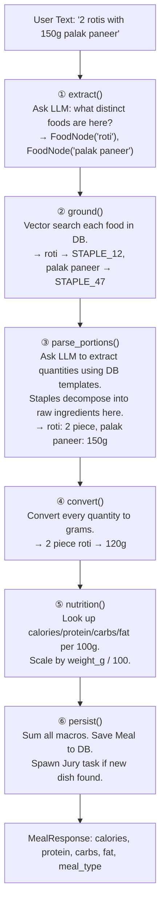

# LyfSync Backend — Mental Model

This is the document to read when you open the codebase and feel lost.
It explains the whole system end-to-end in plain terms.

---

## The Files

| File | One-Line Job |
|---|---|
| `main.py` | Everything: DB models, pipeline, API endpoints |
| `prompts.py` | LLM system prompts and the portion prompt builder |
| `unit_converter.py` | Converts "1 cup oats" or "2 bowls rice" to grams |

That's it. Three files. The backend has no other logic.

---

## What Happens When a User Logs a Meal

The user sends a POST request with raw text like:  
> `"2 rotis with 150g palak paneer"`

The one endpoint that handles this is:

```python
@app.post("/api/v1/meals/parse")
def parse_meal(request: UserInput, ...):
    pipeline = MealPipeline(request.text, db, background_tasks)
    return pipeline.execute()
```

`MealPipeline.execute()` runs six stages in order:



---

## The Data Carrier: FoodNode

`FoodNode` is a Pydantic model that acts as a **passport** for a single food item.
It starts with just a name and portion text, and gets filled in as it passes through each stage.

```
After extract():       original_name="roti", logged_portion="2 rotis", is_cooked_dish=True
After ground():        + food_id="STAPLE_12", db_type="staple", canonical_name="Roti"
After parse_portions(): → splits into raw ingredient nodes: FoodNode("whole wheat flour"), FoodNode("oil")
After convert():       + weight_g=60.0, state="raw", confidence=0.8
After nutrition():     + calories=218.0, protein=6.2, carbs=44.5, fat=3.1
```

Each stage **mutates the FoodNode in place** or **replaces it** — `parse_portions()` can expand one dish node into many ingredient nodes.

---

## The Database Tables

| Table | What It Stores |
|---|---|
| `meals` | Final logged meals (output of the pipeline) |
| `staples` | Recipe templates for cooked dishes (e.g. "Palak Paneer" → raw ingredients + amounts) |
| `usda_raw` | ~500k raw ingredient entries with calories/protein/carbs/fat per 100g |
| `icmr_raw` | Indian food database — same structure as USDA but Indian-specific foods |
| `reference_servings` | Canonical serving sizes ("1 slice bread" = 30g, "1 egg" = 53g) |
| `staples_review` | Staging area for new staple templates awaiting Jury review |

All tables except `meals` are **read-only** during normal pipeline operation.

---

## How FoodResolver Works

`FoodResolver` answers one question: **"Given a food name, what is the best database match?"**

1. Calls `get_embedding(food_name)` → gets a 1536-dim vector from OpenAI.
2. Runs cosine similarity against `staples`, `icmr_raw`, and `usda_raw` in parallel.
3. Picks the winner using thresholds:
   - Staple match with distance ≤ **0.38** → winner is the staple template.
   - Raw match (USDA/ICMR) with distance ≤ **0.30** → winner is the raw ingredient.
   - Cooked dish with no close match → returns `UNMATCHED` (triggers LLM decomposition).

`fetch_by_id` is the fast follow-up: once you have the canonical ID, look it up directly with no embedding needed.

---

## How Unit Conversion Works

`unit_converter.py` converts `"2 cups oats"` into grams using 6 fallback layers, in priority order:

```
Layer 1: Explicit weight?       "200g chicken"    → 200g,  confidence 1.0
Layer 2: Volume × density?      "1 cup milk"      → 247g,  confidence 0.9
Layer 3: ReferenceServing DB?   "1 slice bread"   → 30g,   confidence 0.95
Layer 4: Whole object weight?   "1/3 pizza_whole" → 300g,  confidence 0.8
Layer 5: Colloquial fallback?   "1 bowl rice"     → 200g,  confidence 0.45
Layer 6: Failure                "1 medium banana" → None   → clarification warning
```

If a node returns `None`, its `weight_g` stays `None` and it is **skipped** during the nutrition stage.

---

## The Background Jury

When an **unrecognised cooked dish** is encountered (e.g. "Mushroom Risotto"), the pipeline stores a draft recipe in `staples_review` and spawns a background task: `run_jury_and_update_review`.

The jury independently generates **3 recipe drafts** in parallel, then runs a judge pass to synthesise the best one. This overwrites the draft in `staples_review`. A human can then promote it to the `staples` table.

This all happens **after the API response is already returned** — the user never waits for it.

---

## Where to Make Common Changes

| I want to... | Touch this |
|---|---|
| Change what the LLM extracts from user text | `EXTRACT_DISHES_SYSTEM_PROMPT` in `prompts.py` |
| Change how portions are parsed | `PARSE_PORTIONS_SYSTEM_PROMPT` + `build_portion_prompt()` in `prompts.py` |
| Change how units are converted | `unit_converter.py` |
| Add a new API endpoint | Bottom of `main.py`, after the existing endpoints |
| Add a new DB column | The SQLModel class in `main.py`, then an Alembic migration |
| Change how staples are matched | `FoodResolver.resolve()` thresholds in `main.py` |
| Change the Jury recipe generation | `JURY_GENERATION_PROMPT_TEMPLATE` in `prompts.py` |
| Add a new pipeline stage | Add a method to `MealPipeline`, then call it from `execute()` |
