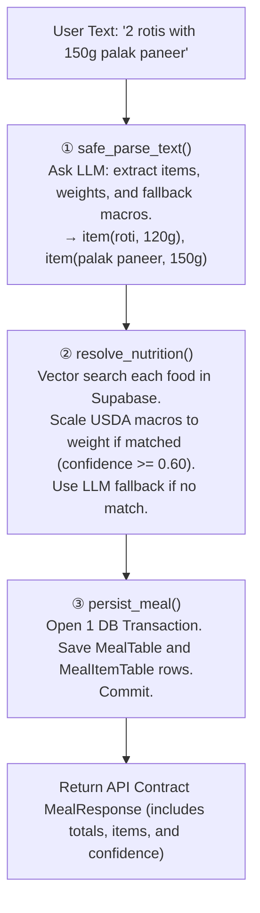

# LyfSync Backend — Mental Model (July 18, 2026)

This is the document to read when you open the codebase and feel lost.
It explains the whole system end-to-end in plain terms.

---

## The Files

| File | One-Line Job |
|---|---|
| `main.py` | Everything: API endpoints, DB models, configuration (`Settings`), and execution logic. |
| `prompts.py` | LLM system prompts for parsing raw text into structured `ParsedMeal` objects. |
| `embeddings.py` | Vector search integration (`pgvector`) and food name normalization to match USDA data. |

That's it. Three files. The backend has been radically simplified to improve reliability.

---

## What Happens When a User Logs a Meal

The user sends a POST request with raw text like:  
> `"2 rotis with 150g palak paneer"`

The endpoint that handles this is `POST /api/v1/meals/parse` in `main.py`.

It executes a linear, 3-step pipeline:

---

## The Data Lifecycle

Data moves between three distinct representations:

1. **`UserInput` (Input Schema)**: Raw text string.
2. **`ParsedMeal` & `MealItem` (LLM Extraction)**: 
   - Strict Pydantic models. 
   - Forces the LLM to structure data (name, weight, estimated macros) but *prevents* the LLM from attempting to do math on the final totals.
3. **`MealTable` & `MealItemTable` (Database Schema)**:
   - SQLModel entities.
   - Saves exactly what was returned to the user, including the `source` (`db_match_high`, `db_match_low`, `llm_fallback`) and `confidence` score of the vector search.

---

## The Database: Supabase + pgvector

We use **Supabase (PostgreSQL)** natively via SQLAlchemy. 

Our food reference dataset lives in the `food_nutrition` table. 
- It contains ~420 cleaned items (mostly single-ingredient staples and produce).
- Each item has a 1536-dimensional `vector_embedding` generated by OpenAI (`text-embedding-3-small`).

When `resolve_nutrition()` is called, we:
1. Normalize the food name (e.g. "curd" → "yogurt") using a hardcoded dictionary.
2. Generate an embedding for the normalized name.
3. Perform a native `pgvector` Cosine Distance search on the database.
4. Return the top match if the `similarity_score` > `0.60`.

---

## Why We Skipped The "Enterprise Theater"

You may notice the lack of deep folder structures (e.g., `src/domain/use_cases/`). 
We explicitly chose to stick to fat modules (`main.py`) using clean helper functions instead of sprawling interfaces. 
We prioritize **Data Integrity (ACID transactions, structured LLM outputs, explicit fallback provenance)** over file architecture complexity. When the application grows beyond 500 lines of routing, we will introduce `APIRouter`.
