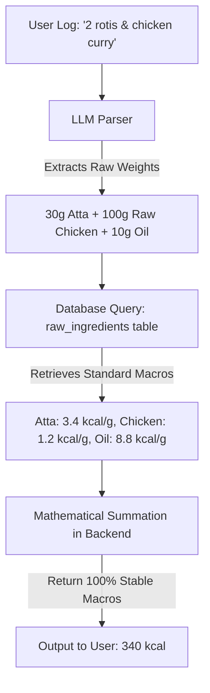

# Research Report: Database Seeding & LLM Consistency Analysis

This report documents the research findings, data quality audits, and LLM consistency experiments performed for the **LyfSync** nutrition tracking backend.

---

## 1. CSV Data Quality Audit

We analyzed the `IndianFoodDatasetCSV.csv` (6,871 recipes) and discovered several data anomalies:
* **Missing Ingredients:** Exactly 6 recipes (e.g. *Pear And Walnut Salad*, *Thai Jasmine Sticky Rice*) have empty ingredient fields and must be excluded.
* **The Parsing Hazard:** Instructions contain actual newlines inside double quotes. Naive file parsing (line-by-line) will break the rows. A robust CSV parser (like Python's `csv` module) is required.
* **Non-Breaking Spaces:** Over 6,400 rows contain the HTML non-breaking space character (`\xa0`) in the instructions/ingredients. These must be replaced with normal spaces (`" "`) to prevent mobile UI rendering bugs.

---

## 2. Supabase Connection & DNS Constraints

* **Free Plan IPv6 Deprecation:** Supabase free tier direct connection (`db.[ref].supabase.co:5432`) is IPv6-only. If the local development machine lacks IPv6 routing, the connection is refused.
* **The Connection Pooler solution:** We successfully bypassed this by connecting through the Supabase connection pooler (`aws-1-[region].pooler.supabase.com:6543`) which resolves to IPv4.
* **PgBouncer Password Sync Delay:** When resetting the database password, PgBouncer has a caching delay of 5–10 minutes. During this window, connections fail with `FATAL: password authentication failed for user "postgres"`, after which it syncs and connects successfully.

---

## 3. Cooked Meal Fluctuation Analysis (gpt-4o-mini)

We ran multiple tests of 10 sequential API calls (at temperature `1.0`) to observe LLM fluctuations on identical user inputs:

### Test A: "I had chicken biryani"
* **Calories:** Min: **600 kcal** | Max: **800 kcal** (Range: **200 kcal**)
* **Protein:** Min: **20.0g** | Max: **35.0g** (75% swing!)
* **Fat:** Min: **20.0g** | Max: **30.0g**

### Test B: "roti, tomato, chicken curry"
* **Calories:** Min: **600 kcal** | Max: **700 kcal** (Range: **100 kcal**)
* **Carbs:** Min: **60.0g** | Max: **90.0g** (Range: **30.0g** — a 50% swing, equivalent to 1.5 extra rotis)
* **Fat:** Min: **15.0g** | Max: **25.0g**

### Test C: Individual Items Tested Separately
* **Roti (10 calls):** Calories fluctuated between **100 kcal** and **210 kcal** (a **110% swing**). The LLM has no standard definition of what a single roti means.
* **Chicken Curry (10 calls):** Calories swung between **300 kcal** and **500 kcal** (Range: **200 kcal**). Carbs swung from **15g to 45g** (300% swing) because the LLM made different assumptions about curry thickeners and ingredients.
* **Tomato (10 calls):** Calories stayed stable between **18 kcal** and **22 kcal** (minimal, basic commodity).

---

## 4. Anuvaad Dataset Audit

We inspected `Anuvaad_INDB_2024.11.xlsx` (1,014 items) and found it unsuitable for cooked dishes:
* **Missing Staples:** **Chicken Biryani** is completely missing from the dataset.
* **Mutton Biryani serving is undercounted:** It lists "1 plate" of Mutton Biryani as only **396.4 kcal** (which represents a tiny side portion, not a standard main-course plate of 800-1100 kcal).
* **Vegetable Biryani has abnormal ratios:** It lists Veg Biryani as **526.5 kcal** but with **28.7g of fat** (50% fat calories) and only **9.5g of protein**.

---

## 5. Raw vs. Cooked LLM Consistency Analysis

We ran 3 independent tests comparing LLM estimations for raw ingredients against USDA Ground Truths:

### A. Raw Chicken Breast (100g)
* **LLM Output:** 165 kcal | 31g Protein | 3.6g Fat (100% consistent across 3 runs)
* **Actual USDA Raw value:** 120 kcal | 22.5g Protein | 2.6g Fat
* **The Trap:** The LLM consistently returned **cooked chicken breast values** (which are more concentrated) for a **raw** chicken breast query. 

### B. Raw Basmati Rice (100g)
* **LLM Output:** 365 kcal | 8g Protein | 80g Carbs
* **USDA Raw value:** 350 kcal | 7.5g Protein | 78g Carbs
* **The Trap (Volume Weight):** The weight of **"1 cup of rice"** swung from **158g to 185g** between runs (a 27g difference) because volume measures are highly ambiguous.

---

## 6. Recommended RAG Architecture

Based on these findings, we recommend a **Raw Ingredients database** approach:

### Key Advantages:
1. **Mathematical Accuracy:** Eliminates LLM calculation hallucinations.
2. **Standardization:** Fixes common volume weights (e.g. 1 tbsp oil = always 15g) to prevent cup/spoon fluctuations.
3. **No Cooked State Confusion:** Avoids cooked vs. raw meat density errors.

---

## 7. The SOTA Benchmark & Portion Priors

During the execution of a 30-case, 14-level SOTA Benchmark, we identified a critical failure point in LLM scaling logic: **Missing Serving-Size Priors** (The "Egg" Problem).
* When asked to scale `"Two eggs"`, the LLM (falling back to a generic `100g egg` template) incorrectly assumed `1 egg = 100g`, doubling the calories (296 kcal instead of 150 kcal).
* **The Fix:** We extracted exactly **311 unique portion metadata priors** (e.g., `1 egg = 53g`, `1 cup milk = 244g`) directly from the USDA `food_portion.csv` dataset, filtering out 10,000+ noisy and lab-grade entries. These priors are stored in a `portion_priors` Supabase table and injected directly into the RAG context, mathematically anchoring the LLM's natural language understanding to real-world serving weights.
