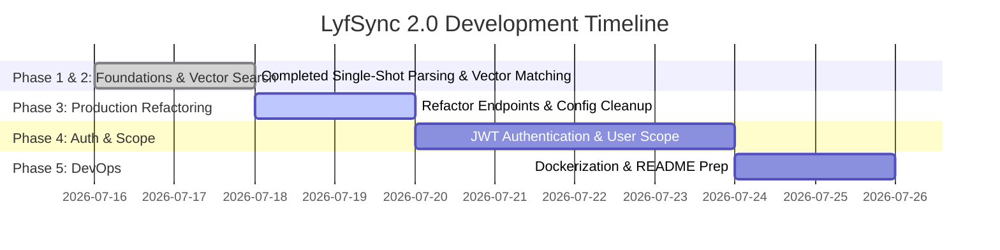

# LyfSync 2.0: Portfolio-Grade Backend Engineering Roadmap

This document outlines the step-by-step engineering roadmap and estimated timeline to transform the **LyfSync 2.0** codebase into a production-ready backend portfolio project. 

The goal of this roadmap is to highlight **complex system design patterns** (testing, clean architecture, vector math, and database optimization) that senior engineering interviewers look for.

---

---

## Phases 1 & 2: Foundations & Vector Matching (Completed)
*Goal: Ensure the codebase is fully tested, accurate, and stable.*

*   [x] **Database configuration:** Set up SQLAlchemy to connect to Supabase (PostgreSQL).
*   [x] **Single-stage AI parsing:** Optimize macro extraction in a single OpenAI request using Pydantic structured outputs.
*   [x] **Itemized DB Persistence:** Added `MealItemTable` to store individual foods for explainability.
*   [x] **Vector Search (Food Lookup):** Native vector similarity search in Supabase using `pgvector` to resolve foods to a USDA/authoritative nutritional baseline.
*   [x] **Confidence Tracking:** Store `source` and `confidence` thresholds to track the provenance of the nutritional data.
*   [x] **Testing:** Direct database and API integration tests in `pytest`.

---

## Phase 3: Production Refactoring (Current Phase)
*Goal: Restructure the codebase to resemble enterprise-grade organization, focusing on simplification first.*

*   [x] **Single Transaction Boundaries:** Group meal and item persistence into a single ACID-compliant database commit with rollback handling.
*   [x] **Helper Extraction:** Split monolithic endpoints into discrete, testable functions (parsing, resolving, persisting).
*   [x] **Configuration Management:** Move environment loading out of utility scripts into a central Pydantic `Settings` class.
*   [ ] **APIRouter Refactoring:** Move endpoints out of `main.py` and group them under logical directories (e.g., `routes/meals.py`).

*(Note: We aggressively skipped non-core features like voice/image parsing and multi-stage recipe juries in favor of building a highly reliable text-to-macro pipeline first).*

---

## Phase 4: User Authentication & Relational Data Scoping
*Goal: Secure the backend and support multiple concurrent users.*

*   **Step 1: User Database Model:** Add a `User` model with fields like `id`, `email`, and `hashed_password`.
*   **Step 2: JWT Security:** Implement JSON Web Tokens (JWT) for secure authentication. Add password hashing using `bcrypt`.
*   **Step 3: DB Relationships:** Link meals to users (One-to-Many relationship). Ensure a user can only view, parse, or delete their *own* meals.

---

## Phase 5: DevOps & Interview Prep
*Goal: Make the project easy for others to deploy and inspect.*

*   **Step 1: Dockerization:** Write a multi-stage `Dockerfile` to containerize the app.
*   **Step 2: Gunicorn/Uvicorn configuration:** Set up Uvicorn worker settings for production stability.
*   **Step 3: Showcase README:** Write an outstanding `README.md` containing System Architecture Diagram, Technical Decisions & Tradeoffs, and run instructions.
