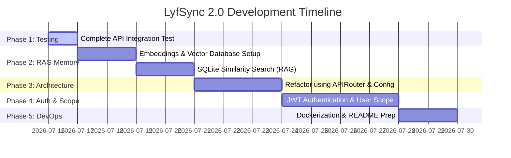

# LyfSync 2.0: Portfolio-Grade Backend Engineering Roadmap

This document outlines the step-by-step engineering roadmap and estimated timeline to transform the **LyfSync 2.0** codebase into a production-ready backend portfolio project. 

The goal of this roadmap is to highlight **complex system design patterns** (testing, clean architecture, vector math, and database optimization) that senior engineering interviewers look for.

---

---

## Phase 1: Testing & Foundations (Current Phase)
*Goal: Ensure the codebase is fully tested, error-free, and stable.*

*   [x] **SQLite database migration:** Switch from heavy PostgreSQL to lightweight, file-based SQLite.
*   [x] **Single-stage AI parsing:** Optimize macro extraction in a single OpenAI request.
*   [x] **DB unit testing (`test_db.py`):** Direct database write and read validation.
*   [ ] **API integration testing (`test_api.py`):** Fully complete the `/parse` endpoint test with assertions.
*   [ ] **Warning Resolution:** Clean up the Python 3.12 UTC deprecation warning.
*   **Interview Value:** Demonstrates your commitment to software quality and automated testing hygiene.

---

## Phase 2: Vector Search & Local RAG (AI Memory)
*Goal: Implement a simple local Retrieval-Augmented Generation (RAG) memory in SQLite.*

*   **Step 1: Text Embeddings:** When a user logs a meal, generate a vector embedding of the text using OpenAI's `text-embedding-3-small` model.
*   **Step 2: SQLite Schema Upgrade:** Add a `vector_embedding` column to the `Meal` model.
*   **Step 3: Cosine Similarity in Python:** Write a helper function that calculates the cosine similarity between two lists of floats (embeddings) using pure Python/NumPy math.
*   **Step 4: Past Meal Retrieval (RAG):** When a user logs a meal, query their historical meals, calculate the most similar past meals, and feed that context back to the LLM.
    *   *Example:* If they write "Same sandwich as last Tuesday," the vector search finds last Tuesday's sandwich, retrieves its macros, and instantly copies them over.
*   **Interview Value:** Demonstrates strong familiarity with embeddings, mathematical calculations (cosine distance), and practical AI/RAG integration.

---

## Phase 3: Production Refactoring (Clean Architecture)
*Goal: Restructure the codebase to resemble enterprise-grade organization.*

*   **Step 1: APIRouter Refactoring:** Move endpoints out of `main.py` and group them under logical directories (e.g. `routes/meals.py`, `routes/auth.py`).
*   **Step 2: Configuration Management:** Switch from raw `os.getenv` to **`Pydantic Settings`**, creating a strongly typed `Config` class to validate all environment variables on boot.
*   **Step 3: Scoped DB sessions:** Ensure database sessions are handled clean-up wise on transaction failures (rollbacks).
*   **Interview Value:** Proves you know how to build clean, maintainable, and modular directories that scale as the team grows.

---

## Phase 4: User Authentication & Relational Data Scoping
*Goal: Secure the backend and support multiple concurrent users.*

*   **Step 1: User Database Model:** Add a `User` model with fields like `id`, `email`, and `hashed_password`.
*   **Step 2: JWT Security:** Implement JSON Web Tokens (JWT) for secure authentication. Add password hashing using `bcrypt`.
*   **Step 3: DB Relationships:** Link meals to users (One-to-Many relationship). Ensure a user can only view, parse, or delete their *own* meals.
*   **Interview Value:** Shows you can build secure, production-grade applications that protect user data privacy.

---

## Phase 5: DevOps & Interview Prep
*Goal: Make the project easy for others to deploy and inspect.*

*   **Step 1: Dockerization:** Write a multi-stage `Dockerfile` to containerize the app.
*   **Step 2: Gunicorn/Uvicorn configuration:** Set up Uvicorn worker settings for production stability.
*   **Step 3: Showcase README:** Write an outstanding `README.md` containing:
    *   System Architecture Diagram (using Mermaid).
    *   A list of "Technical Decisions & Tradeoffs" (e.g., SQLite vs Postgres, Sync vs Async threadpools).
    *   Clear instructions on how to run tests, checks, and coverage.
*   **Interview Value:** Shows you have empathy for operations engineers and can document your decisions clearly.

---

## Timeline Estimate (Pair Programming)

If we work together for 1-2 hours a day:
*   **Phase 1:** Complete today (0.5 days).
*   **Phase 2:** 2–3 days.
*   **Phase 3:** 2 days.
*   **Phase 4:** 3 days.
*   **Phase 5:** 1–2 days.
*   **Total Time:** **~1.5 to 2 weeks** to a fully complete, resume-worthy masterclass project!
